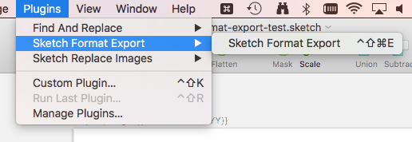

# Sketch Format Export

A Sketch plugin that exports artboards while also replacing formatted placeholders of text.

## How to use it

#### 1. Insert placeholder text

Placeholder text can be entered in two places, text layers and artboard names. See [Placeholder Formats](#placeholder-Formats) for how to use placeholder text. 

| |
| --- |
|  |
| Text layer example  |

| |
| --- |
|  |
| Artboard name example  |

#### 2. Make the artboards exportable

Add your export presets like normal. They will all be exported.

#### 3. Select an artboard to export

Select artboards to export by selecting them in the artboard palette and/or by selecting layers within the artboard.

#### 4. Export the artboards

Export the selected artboards from the Plugins menu or by using the keyboard shortcut.

## Placeholder Formats

#### Date Placeholder Format

The date placeholder replaces the placeholder text with the current date.

The format is as follows:`{{%d``your placeholder``}}`

Below are the available tokens: 

|       | Token         | Output        |
| ----- | ------------- | ------------- |
| Month | MM  | 01 02... 12 |
| Day   | DD  | 01 02... 31 |
| Year  | YY  | 17 18... 00 |
|       | YYYY  | 2017 2018... 2100 |

So, for example, if the date is currently May 2nd 2017, the placeholder `{{%dMM-DD-YYYY}}` will export ``05-02-2017``.

## Example

Included is an example Sketch file, [format-export-test.sketch](./format-export-test.sketch).
